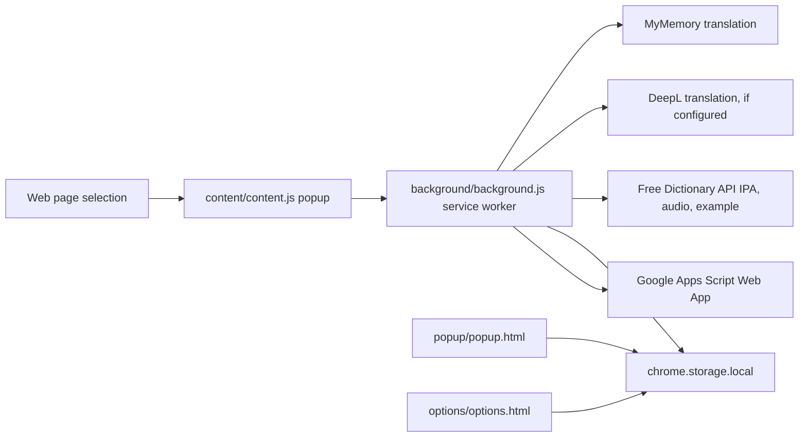

# Vocabulary Collector Idea Plan

## Product idea

Vocabulary Collector is a lightweight Chrome extension for language learners who read English online and want to keep useful words without breaking their reading flow.

The core loop is:

1. Select a word or phrase while reading.
2. See a compact popup with Vietnamese meaning, IPA when applicable, example, and dictionary links.
3. Save the item.
4. Review or export the saved vocabulary later.

The product should feel fast, personal, and low-friction. The first serious user value is not spaced repetition or a large dashboard; it is trustworthy capture at the moment of reading.

## Current architecture



## Implementation status

### Phase 1: selection UX

Done.

- Detects selected text on normal webpages.
- Shows a popup near the selection.
- Opens Cambridge and Wiktionary.
- Provides a right-click fallback.
- Saves records locally.
- Shows recent saves in the toolbar popup.
- Lets the user delete individual local saves from the toolbar popup.
- Lets the user push all local saves back to Google Sheets after sync issues are fixed.

### Phase 2: real lookup

Done for the extension-side implementation.

- DeepL is supported when the user adds an API key in settings.
- A small built-in glossary improves common tech terms such as `developer` and `IT`.
- MyMemory is used as the no-setup fallback.
- Free Dictionary API provides IPA, a sound link, and an example for single English words when available.
- Plural words can fall back to likely singular forms for IPA, such as `developers` to `developer`.
- Phrases are translated, but IPA is skipped intentionally.
- Lookup errors do not block saving.

### Phase 3: Google Sheets save path

Done as a configurable integration.

- The extension saves every item locally first.
- If Google Sheets sync is enabled, new saves are also posted to a configured Apps Script Web App URL.
- The extension requires a shared webhook secret so Apps Script can reject unexpected posts.
- The settings page includes a Google Sheets test action that appends a `__sync_test__` row.
- The toolbar popup includes a sync-all repair action for local items.
- Failed sync does not lose the word; the saved item is marked local-only with an error.
- Deleting from the toolbar popup currently removes the local copy only; synced Sheet rows must be removed from Google Sheets manually.

This keeps private credentials outside the extension repo and lets the user control the destination Sheet.

## Data model

Saved records are stored in `chrome.storage.local` under `savedWords`.

```json
{
  "id": "vc-1780000000000-a1b2c3-salient",
  "text": "salient",
  "normalized": "salient",
  "meaning": "nổi bật",
  "ipa": "/ˈseɪ.li.ənt/",
  "dictionaryText": "salient",
  "audioUrl": "https://ssl.gstatic.com/dictionary/static/sounds/example.mp3",
  "example": "A short example sentence from the dictionary API.",
  "cambridgeUrl": "https://dictionary.cambridge.org/dictionary/english/salient",
  "translationProvider": "MyMemory",
  "ipaProvider": "Free Dictionary API",
  "createdAt": "2026-07-09T00:00:00.000Z",
  "synced": false,
  "syncError": ""
}
```

## Google Sheets row format

The recommended Sheet columns are:

1. English
2. Vietnamese meaning
3. IPA
4. Sound link
5. Example
6. Cambridge Dictionary link

## Important decisions

- Keep the extension dependency-free for now.
- Keep lookup and saving in the background service worker instead of directly in the content script.
- Use `chrome.runtime.sendMessage` with asynchronous responses so the content popup stays simple.
- Do not store Google credentials in the repo.
- Use Apps Script as the lowest-friction Google Sheets backend.
- Continue to save locally even when remote sync fails.
- Prefer curated meanings for a small set of high-value tech terms when machine translation is unnatural.
- Try singular dictionary candidates for plural words so IPA is more likely to be available.
- Do not send source page titles or URLs to Google Sheets; keep sync data focused on the vocabulary fields.
- Redact deployed Apps Script URLs in extension error messages because the URL is part of the write endpoint.
- Require a webhook secret for Sheets sync. Anyone with both the Web App URL and secret could write rows.

## Manual acceptance test

1. Load the unpacked extension in Chrome.
2. Select `salient`.
3. Confirm the popup appears near the selection.
4. Confirm Vietnamese meaning appears.
5. Confirm IPA appears.
6. Open Cambridge and Wiktionary from the popup.
7. Save the word.
8. Confirm the toolbar popup shows the saved record.
9. Try saving the same word again and confirm duplicate prevention.
10. Delete the saved record from the toolbar popup and confirm it disappears locally.
11. Select `to be honest`.
12. Confirm phrase translation appears and IPA is skipped.
13. Configure a Google Apps Script Web App URL.
14. Use the settings test button and confirm a `__sync_test__` row appears in the English column.
15. Save a new word and confirm the Sheet row has English, Vietnamese meaning, IPA, sound link, example, and Cambridge link.
16. Click Sync all in the toolbar popup and confirm the Sheet is updated without duplicate rows for already-synced items.
17. Break the Web App URL intentionally and confirm local save still works.

## Next milestones

1. Add remote row delete support for Google Sheets.
2. Add import/pull-from-Sheet support if the Sheet should become the source of truth.
3. Add export to CSV as a no-account backup path.
4. Add edit controls for individual saved words.
5. Add a small review mode in the toolbar popup.
6. Improve translation quality by storing multiple meanings or examples.
7. Add automated tests around URL builders, storage dedupe, and response parsing.
8. Prepare Chrome Web Store assets and privacy notes if the extension will be published.
